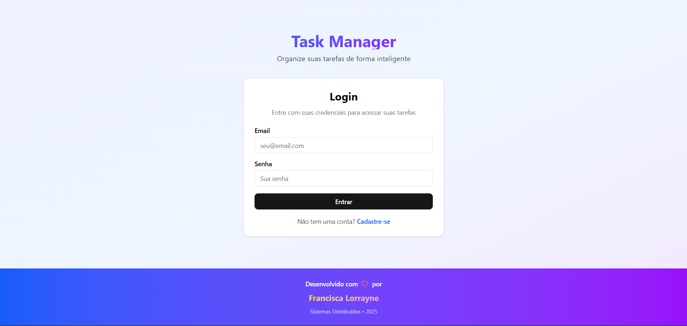
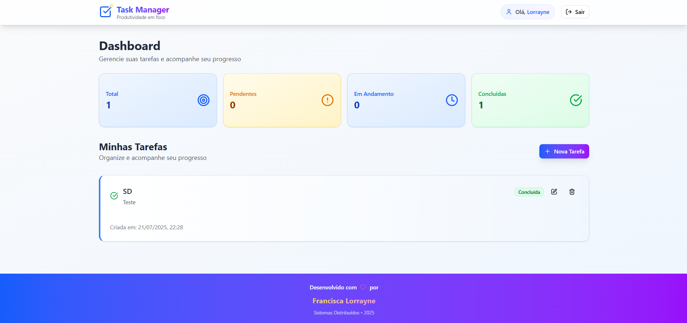
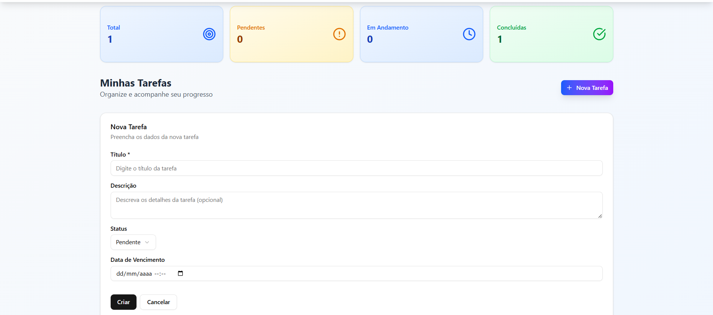

# Task Manager – Projeto Final de Sistemas Distribuídos

Sistema completo de gerenciamento de tarefas, desenvolvido por **Lorrayne** como projeto final da disciplina **Sistemas Distribuídos**. O sistema implementa arquitetura de **três camadas** com comunicação via **APIs REST**, autenticação via **JWT**, acesso **multiplataforma (Web e Android)**, e deploy com **DNS personalizado** usando AWS.

---

## Telas do Sistema

| Tela de Login | Tela de Registro | Tela de Tarefas |
|---------------|------------------|------------------|
|  |  |  |


> As imagens acima devem estar na pasta `public/screenshots/` com os nomes correspondentes, como `login.png`, `register.png`, e `tasks.png`.

## Arquitetura

O sistema segue uma **arquitetura de três camadas**:

```
Apresentação (React + Android)
         ↓
Negócios (Flask API + JWT)
         ↓
Dados (DynamoDB)
```

- **Frontend Web:** React + Vite + Tailwind  
- **Aplicativo Android:** PWA
- **Backend:** AWS Lambda com Flask + JWT + DynamoDB  
- **Infraestrutura (Deploy):** AWS (Lambda, API Gateway, DynamoDB, Route 53, S3 para frontend)

---

## Como Executar

### Backend - Flask API
```bash
cd task-manager-api
python -m venv venv
source venv/bin/activate  # Linux/Mac
# venv\Scripts\activate    # Windows
pip install -r requirements.txt
python src/main.py
```
> A API estará disponível em: `http://localhost:5000`

### Frontend - React
```bash
cd task-manager-frontend
npm install
npm run dev
```
> Frontend disponível em: `http://localhost:5173`

### Aplicativo PWA (Progressive Web App)
1. Acesse o frontend (`http://localhost:5173`) via navegador no smartphone  
2. Toque em “Adicionar à tela inicial” para instalar o PWA  
3. O app funcionará como uma aplicação nativa, com suporte offline básico e interface responsiva

---

## Estrutura de Diretórios

```
task-manager-projeto-completo/
├── task-manager-frontend/    # Frontend React
├── screenshots/              # Imagens das telas (para o README)
├── project_plan.md           # Documento detalhado do projeto
└── README.md                 # Este arquivo
```

---

## Funcionalidades de Autenticação

- Registro e login com **JWT**
- Middleware de verificação de token
- Proteção de rotas (usuário só acessa suas próprias tarefas)

---

## Funcionalidades Principais

### Web e Android

- Registro e Login de usuários  
- Criar, visualizar, editar e excluir tarefas  
- Filtro por status (pendente, em andamento, concluída)  
- Responsivo e acessível via navegador ou celular  

### Endpoints da API (RESTful)

```http
POST   /api/auth/register   # Criar conta
POST   /api/auth/login      # Login
GET    /api/auth/me         # Ver perfil logado

GET    /api/tasks           # Listar tarefas
POST   /api/tasks           # Criar tarefa
GET    /api/tasks/{id}      # Ver tarefa
PUT    /api/tasks/{id}      # Atualizar
DELETE /api/tasks/{id}      # Deletar
```

---

## Configuração de DNS

- SEUNOME.DNS → Frontend (React)  
- api.SEUNOME → API (Flask via API Gateway)

**Exemplo:**
```
SEUNOME.DNS        A    192.168.1.100
api.SEUNOME        A    192.168.1.100
```

---

## Tecnologias Utilizadas

### Frontend
- React 19 + Vite
- Tailwind CSS + Shadcn/ui
- Axios

### Backend
- Python 3.11 + Flask
- Flask-JWT-Extended + Flask-CORS
- DynamoDB

### Mobile
- Progressive Web App (PWA)
- Instalação via navegador em dispositivos móveis
- Responsivo, com suporte a ícone, splash screen e navegação offline

---

## Documentação Técnica

Veja o arquivo [`project_plan.md`](./project_plan.md) para:

- Conceito detalhado
- Banco de dados: AWS DynamoDB
- Infraestrutura: AWS Lambda, API Gateway, S3, Route 53
- Comunicação: APIs REST
- Segurança: JWT e validação com AWS IAM
- Diagrama de arquitetura
- Descrição das camadas
- Tecnologias AWS utilizadas
- Cronograma de desenvolvimento

---

## Desenvolvido Por

**Francisca Lorrayne**  
Discente de Bacharelado em Tecnologia da Informação – UFERSA  
Projeto final para a disciplina **Sistemas Distribuídos**