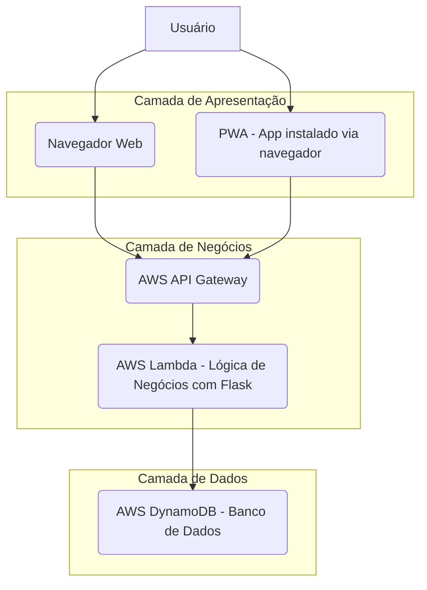

# Plano do Projeto Final - Sistemas Distribuídos (Ajustado)

## 1. Introdução

Este documento detalha o plano para o desenvolvimento de um sistema completo de gerenciamento de tarefas (Task Manager) como projeto final da disciplina de Sistemas Distribuídos. O objetivo é demonstrar as competências adquiridas no curso, aplicando conceitos de arquitetura de três camadas, comunicação via APIs REST, autenticação via JWT, acesso multiplataforma (Web e Android), e deploy com DNS personalizado usando AWS. O projeto será desenvolvido utilizando serviços da Amazon Web Services (AWS) para a infraestrutura de backend e uma aplicação web e móvel para o frontend.

## 2. Conceito do Sistema: Task Manager

O sistema será um gerenciador de tarefas, permitindo que usuários autenticados criem, visualizem, editem e excluam suas tarefas. Cada tarefa terá um título, uma descrição, uma data de vencimento e um status (pendente, em andamento, concluída).

### Requisitos Funcionais:

*   **Autenticação de Usuário:** Registro e login de usuários.
*   **Gerenciamento de Tarefas:**
    *   Criar nova tarefa.
    *   Visualizar lista de tarefas (filtradas por usuário).
    *   Visualizar detalhes de uma tarefa específica.
    *   Editar tarefa existente.
    *   Excluir tarefa.
*   **Acesso Multiplataforma:**
    *   Interface web responsiva (SPA com PWA).
    *   Funciona como app móvel via navegador (instalável na tela inicial).

### Requisitos Não Funcionais:

*   **Arquitetura:** Três camadas (apresentação, negócios, dados).
*   **Comunicação:** APIs RESTful baseadas em recursos.
*   **DNS:** Acesso à aplicação via `SEUNOME.DNS` e à API via `api.SEUNOME`.
*   **Segurança:** Autenticação JWT e autorização de chamadas à API.
*   **Escalabilidade:** Utilização de serviços AWS serverless.
*   **Disponibilidade:** Alta disponibilidade proporcionada pelos serviços AWS.
*   **Performance:** Respostas rápidas da API e carregamento eficiente da interface.


## 3. Arquitetura do Sistema

O sistema seguirá uma arquitetura de três camadas:

1.  **Camada de Apresentação (Frontend):** Responsável pela interface do usuário. Será composta por uma aplicação web (SPA - Single Page Application) desenvolvida com React e um aplicativo móvel Android (PWA). Ambas as interfaces se comunicarão com a camada de negócios via APIs REST.
2.  **Camada de Negócios (Backend/API):** Contém a lógica de negócios e orquestra as operações. Será implementada utilizando AWS Lambda para as funções serverless, com o framework Flask para a lógica da API, e AWS API Gateway para expor as APIs RESTful. Esta camada se comunicará com a camada de dados.
3.  **Camada de Dados (Database):** Responsável pelo armazenamento e recuperação dos dados. Será implementada utilizando AWS DynamoDB, um banco de dados NoSQL totalmente gerenciado.

### Diagrama de Arquitetura (Conceitual):




## 4. Tecnologias AWS a Serem Utilizadas

*   **AWS Lambda:** Para executar o código de backend (com Flask) sem provisionar ou gerenciar servidores. Cada endpoint da API será uma função Lambda.
*   **AWS API Gateway:** Para criar, publicar, manter, monitorar e proteger APIs RESTful em escala. Atuará como o ponto de entrada para todas as requisições do frontend.
*   **AWS DynamoDB:** Banco de dados NoSQL para armazenar dados de usuários e tarefas. Será a camada de persistência.
*   **AWS S3:** Para hospedar os arquivos estáticos da aplicação web (frontend).
*   **AWS Route 53:** Para gerenciar o DNS e configurar os domínios personalizados (`SEUNOME.DNS` e `api.SEUNOME`).
*   **AWS Cognito (Opcional/Considerar):** Para gerenciamento de usuários e autenticação. Pode simplificar a implementação de JWT.
*   **AWS IAM:** Para gerenciar permissões de acesso entre os serviços AWS.


## 5. Estrutura das APIs REST

As APIs seguirão o padrão RESTful, com recursos bem definidos e métodos HTTP apropriados.

### Recursos:

*   `/auth`
*   `/tasks`

### Endpoints (Exemplos):

| Recurso | Método HTTP | Endpoint | Descrição |
|---|---|---|---|
| Autenticação | `POST` | `/api/auth/register` | Registrar novo usuário |
| Autenticação | `POST` | `/api/auth/login` | Autenticar usuário e retornar JWT |
| Autenticação | `GET` | `/api/auth/me` | Ver perfil logado |
| Tarefas | `POST` | `/api/tasks` | Criar nova tarefa |
| Tarefas | `GET` | `/api/tasks` | Listar todas as tarefas do usuário |
| Tarefas | `GET` | `/api/tasks/{id}` | Obter detalhes de uma tarefa específica |
| Tarefas | `PUT` | `api/tasks/{id}` | Atualizar tarefa existente |
| Tarefas | `DELETE` | `/api/tasks/{id}` | Excluir tarefa |


## 6. Autenticação e Autorização

O sistema implementará autenticação baseada em JSON Web Tokens (JWT) para garantir a segurança das APIs. O fluxo será o seguinte:

1.  **Login:** O usuário envia suas credenciais (email/senha) para o endpoint `/api/auth/login`.
2.  **Geração de JWT:** A função Lambda de login valida as credenciais e, se corretas, gera um JWT assinado com um segredo. Este token contém informações sobre o usuário (e.g., ID do usuário).
3.  **Retorno do JWT:** O JWT é retornado ao cliente (frontend web ou aplicativo Android).
4.  **Armazenamento do JWT:** O cliente armazena o JWT (e.g., em `localStorage` para web, `SharedPreferences` para Android).
5.  **Requisições Autenticadas:** Para acessar recursos protegidos (e.g., `/api/tasks`), o cliente deve incluir o JWT no cabeçalho `Authorization` da requisição (formato `Bearer <token>`).
6.  **Validação do JWT:** O AWS API Gateway, em conjunto com uma função Lambda Authorizer (ou diretamente na função Lambda principal), interceptará a requisição, validará o JWT (verificando a assinatura e a expiração) e extrairá as informações do usuário. Se o token for inválido ou ausente, a requisição será rejeitada.
7.  **Autorização:** Com o ID do usuário extraído do JWT, a lógica de negócios (Lambda) garantirá que o usuário só possa acessar ou manipular suas próprias tarefas, implementando regras de autorização.


## 7. Desenvolvimento do Frontend Web

A aplicação web será uma Single Page Application (SPA) desenvolvida com React, Vite e Tailwind CSS. Será hospedada no AWS S3 e distribuída via Amazon CloudFront para melhor performance e segurança.

### Funcionalidades:

*   Página de login e registro.
*   Dashboard com a lista de tarefas do usuário.
*   Formulários para criar, editar e visualizar tarefas.
*   Navegação entre as páginas.
*   Consumo das APIs RESTful do backend.


## 8. Desenvolvimento do Aplicativo PWA

O sistema possui um Progressive Web App (PWA) integrado ao frontend React, que permite instalação em dispositivos móveis via navegador, funcionando como um app nativo.

### Funcionalidades:

*   Tela de login e registro.
*   Listagem de tarefas.
*   Criação, edição e exclusão de tarefas.
*   Instalação via navegador na tela inicial do celular.
*   Navegação fluida e responsiva.


## 9. Configuração de DNS e Deploy

Para atender aos requisitos de DNS, será utilizado o AWS Route 53 para gerenciar os domínios.

*   **Domínio Principal:** `SEUNOME.DNS` (ex: `meuprojeto.com.br`) apontará para a aplicação web hospedada no S3/CloudFront.
*   **Subdomínio API:** `api.SEUNOME` (ex: `api.meuprojeto.com.br`) apontará para o AWS API Gateway.

O deploy será realizado da seguinte forma:

*   **Frontend Web:** Os arquivos estáticos serão enviados para um bucket S3 configurado para hospedagem de site estático, com CloudFront para CDN e HTTPS.
*   **Backend (APIs):** As funções Lambda e o API Gateway serão implantados via AWS SAM (Serverless Application Model) ou AWS CDK para automação e versionamento da infraestrutura como código.


## 10. Estrutura de Diretórios

```
task-manager-projeto-completo/
├── task-manager-frontend/    # Frontend React
├── screenshots/              # Imagens das telas (para o README)
├── project_plan.md           # Documento detalhado do projeto
└── README.md                 # Este arquivo
```


## 11. Cronograma (Estimativa)

| Fase | Descrição | Duração Estimada |
|---|---|---|
| 1 | Planejamento e Arquitetura | 1 dia |
| 2 | API REST (Lambda/API Gateway) | 3 dias |
| 3 | Frontend Web | 3 dias |
| 4 | Banco de Dados (DynamoDB) | 1 dia |
| 5 | Autenticação/Autorização | 2 dias |
| 6 | Suporte PWA e responsividade mobile | 2 dias |
| 7 | DNS e Deploy | 1 dia |
| 8 | Documentação e Entrega | 2 dias |
| **Total** | | **16 dias** |

*Nota: Este cronograma é uma estimativa e pode ser ajustado conforme o progresso e complexidade das tarefas.*


